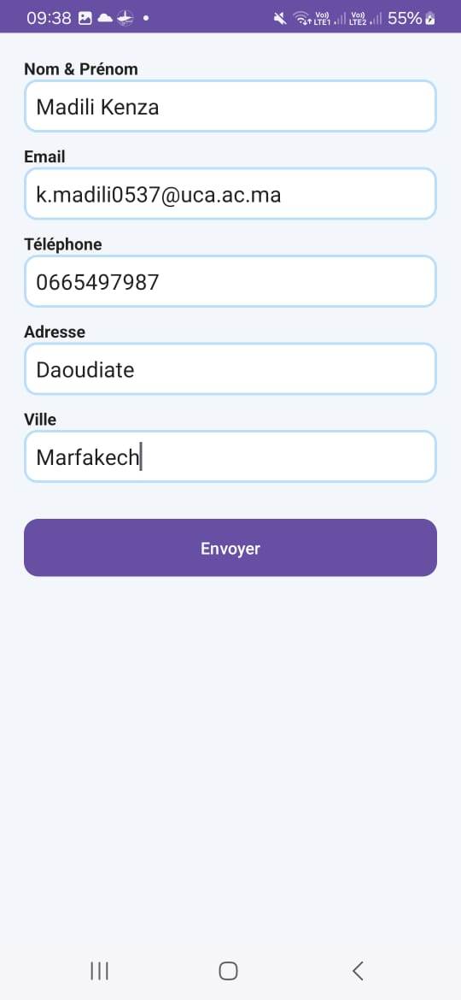
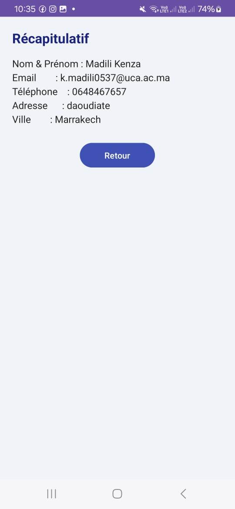

# 📱 Application Android – Formulaire Utilisateur (Multi-Activity)

## 📝 Description

Cette application Android permet à l’utilisateur de saisir ses informations personnelles à travers un formulaire, puis d’afficher ces données dans un second écran.

L’application est composée de deux activités :

* **MainActivity** : saisie des informations
* **ResultActivity** : affichage des données saisies

---

## 🎯 Objectifs du LAB

* Manipuler les composants d’interface (EditText, TextView, Button)
* Implémenter un formulaire interactif
* Valider les données utilisateur
* Comprendre la navigation entre activités (Intent)
* Transmettre des données entre écrans

---

## ⚙️ Fonctionnalités

### 🔹 Formulaire (MainActivity)

* ✔️ Saisie du nom et prénom
* ✔️ Saisie de l’email
* ✔️ Saisie du téléphone
* ✔️ Saisie de l’adresse
* ✔️ Saisie de la ville
* ✔️ Validation des champs
* ✔️ Vérification du format email
* ✔️ Vérification du numéro de téléphone

### 🔹 Résultat (ResultActivity)

* ✔️ Affichage des informations saisies
* ✔️ Interface simple et lisible

---

## 🔄 Fonctionnement

1. L’utilisateur remplit le formulaire
2. Clique sur le bouton **Envoyer**
3. Les données sont validées
4. Une nouvelle activité s’ouvre
5. Les informations sont affichées

---

## 🧠 Technologies utilisées

* **Langage** : Java
* **IDE** : Android Studio
* **Interface** : XML
* **Navigation** : Intent

---

## 📸 Captures d’écran

### 🔹 Formulaire



### 🔹 Résultat




---

## ▶️ Exécution

1. Ouvrir le projet avec Android Studio
2. Connecter un téléphone ou lancer un émulateur
3. Cliquer sur ▶️ Run
4. Remplir le formulaire
5. Cliquer sur **Envoyer**
6. Visualiser les données dans le second écran

---

## 📂 Structure du projet

```id="a7h3p2"
app/
 ├── java/.../
 │    ├── MainActivity.java
 │    └── ResultActivity.java
 │
 ├── res/
 │    ├── layout/
 │    │    ├── activity_main.xml
 │    │    └── activity_result.xml
 │    │
 │    ├── values/
 │    │    ├── colors.xml
 │    │    └── strings.xml
 │    │
 │    └── drawable/
```

---

## 💡 Améliorations possibles

* Ajouter un bouton **Retour**
* Améliorer le design avec Material Design
* Sauvegarder les données (SQLite ou SharedPreferences)
* Ajouter une validation avancée
* Ajouter une image ou avatar utilisateur

---

## 👩‍💻 Réalisé par

**Kenza Madili**

---

## 📌 Conclusion

Ce LAB permet de maîtriser les bases du développement Android, notamment la gestion des formulaires, la validation des données et la communication entre différentes activités.
Il représente une étape importante vers la création d’applications mobiles complètes et interactives.
